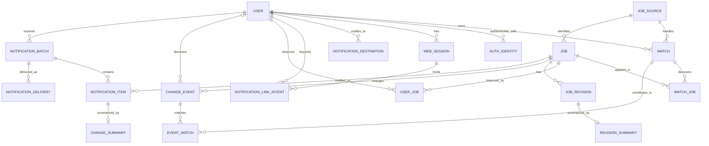

# 求人監視データモデル

- 状態: Draft
- 対象: 求人変更監視の永続データ

## 背景・制約

求人内容は通知に必須な求人タイトルを除いて項目別に構造化しない。詳細ページの生HTMLは保存せず、サイト固有のallowlistで抽出・正規化した求人固有HTMLだけを版として保持する。サイト内求人IDはサイト間で衝突し得るため、求人の主キーには使用せず、`source_key`との複合一意制約を設ける。

## 全体構成

## コンポーネントと責務

| エンティティ | 主な属性 | 制約・用途 |
| --- | --- | --- |
| `user` | `id`, `status`, `timezone`, `created_at` | 利用者。外部プロバイダーのIDを主キーにしない。 |
| `auth_identity` | `id`, `user_id`, `provider_key`, `subject`, `created_at`, `last_login_at` | JobHunterログイン用の外部認証ID。初期providerは`google`。`(provider_key, subject)`を一意にし、メールアドレスを同一性キーにしない。 |
| `web_session` | `id`, `user_id`, `expires_at`, `revoked_at`, `created_at` | ログインセッション。cookieには推測不能な参照値だけを設定する。 |
| `notification_link_intent` | `id`, `user_id`, `web_session_id`, `channel_key`, `purpose`, `state_hash`, `nonce_hash`, `expires_at`, `consumed_at` | ログイン済み利用者が開始した通知先連携要求。短時間・1回限りで、初期用途は`ENABLE_LINE_NOTIFICATION`。 |
| `notification_destination` | `id`, `user_id`, `channel_key`, `external_recipient_id`, `status`, `last_verified_at` | LINE等の通知先。`(channel_key, external_recipient_id)`を一意にする。状態は`PENDING_LINK`、`ACTION_REQUIRED`、`ACTIVE`、`BLOCKED`、`DISABLED`。 |
| `job_source` | `key`, `display_name`, `status`, `policy`, `failure_window` | 求人サイト設定。`key`は`atgp`などの安定識別子。状態は`ACTIVE`、`CIRCUIT_OPEN`、`ACQUISITION_PROHIBITED`。`policy`は取得許可根拠、サイト別安全上限、解析失敗閾値を含む。 |
| `watch` | `id`, `user_id`, `source_key`, `search_url`, `interval`, `next_run_at`, `baseline_completed_at`, `status` | 利用者が所有する検索結果URLの監視設定。`interval`は既定`24h`で`12h`も選択できる。状態は`BASELINING`、`ACTIVE`、`STOPPED`、`NEEDS_ATTENTION`。`(user_id, source_key, search_url)`に一意制約を設ける。 |
| `job` | `id`, `source_key`, `external_job_id`, `title`, `detail_url`, `current_revision_id`, `is_deleted`, `state_generation`, `removal_candidate_since`, `consecutive_not_found_count`, `deleted_at`, `last_checked_at` | 求人の現在状態。`title`は正常取得ごとに更新する表示用メタデータで、変更判定には使用しない。`(source_key, external_job_id)`を一意にする。`state_generation`は有効・削除の実状態遷移ごとに増加する。 |
| `watch_job` | `watch_id`, `job_id`, `first_seen_at`, `last_seen_at` | どの監視検索で発見したか。`(watch_id, job_id)`を一意にする。検索結果から消えただけでは削除しない。 |
| `user_job` | `user_id`, `job_id`, `first_seen_at`, `discovered_after_baseline`, `last_notified_revision_id` | 利用者が一度でも求人を観測した事実。`(user_id, job_id)`を一意にし、複数の監視設定にまたがる利用者向け発見の重複を防ぐ。最後に通知した版を次回更新要約の比較基準として保持する。 |
| `job_revision` | `id`, `job_id`, `sequence`, `title`, `detail_url`, `content_html`, `content_hash`, `extractor_version`, `fetched_at` | 求人タイトルと求人固有canonical HTMLの不変版。`(job_id, sequence)`を一意にする。通常は現在版と直前版だけを保持し、ページ全体の生HTMLは保存しない。 |
| `revision_summary` | `revision_id`, `status`, `content`, `attempt_count`, `last_error` | 求人の現在版に対する利用者間で共有する現在要約。LINE通知の状態にかかわらずWeb表示用に生成する。 |
| `change_event` | `id`, `type`, `job_id`, `user_id`, `before_revision_id`, `after_revision_id`, `state_generation`, `deduplication_key`, `occurred_at` | `DISCOVERED`、`UPDATED`、`DELETED`、`RELISTED`。`DISCOVERED`だけが`user_id`を持ち、他の種別は求人単位の事実とする。重複排除キーを一意にする。 |
| `event_watch` | `event_id`, `watch_id` | イベントに該当した利用者所有の監視設定。`(event_id, watch_id)`を一意にし、イベント本体を複製せず該当条件を保持する。 |
| `notification_batch` | `id`, `user_id`, `kind`, `scheduled_for`, `status`, `created_at` | 利用者の通知時刻ごとのダイジェスト。`kind`は`NORMAL`または`DELAYED`。通常枠と遅延確認時刻について一意にする。 |
| `notification_item` | `id`, `batch_id`, `job_id`, `kind`, `before_revision_id`, `after_revision_id`, `title`, `detail_url`, `status` | ダイジェスト内の求人単位項目。`(batch_id, job_id)`を一意にし、通知前の複数イベントを最新状態へ集約する。 |
| `change_summary` | `notification_item_id`, `status`, `content`, `attempt_count`, `last_error` | 求人単位の通知項目に対する変更要約。要約失敗時は項目に保存したタイトルとURLを使用する。 |
| `notification_delivery` | `id`, `batch_id`, `notification_destination_id`, `status`, `attempt_count`, `next_attempt_at` | ダイジェストと通知先の組を一意にする。チャネル上限によるメッセージ分割を同じ配信として管理する。 |
| `codex_usage` | `period_kind`, `period_start`, `input_units`, `output_units`, `run_count`, `updated_at` | 日次・月次の利用量上限を判定する集計。期間と種別を一意にする。 |
| `work_item` | `id`, `kind`, `deduplication_key`, `payload`, `available_at`, `lease_until`, `attempt_count`, `status` | 検索取得、詳細取得、要約、通知の永続作業キュー。 |

求人固有canonical HTMLはSQLite内に保存する前提で開始する。SQLAlchemyのORMモデルとSessionを永続化層へ集約する。求人ごとに現在版と直前版だけを通常保持する。未処理または再試行中の通知項目が参照する版は処理完了まで追加保持し、参照がなくなった時点で削除する。

## データフロー

変更検知時は、次を1トランザクションで行う。

1. SQLiteの短い書き込みトランザクションを開始し、対象`job`の直前状態を再確認する。
2. 必要なら`job_revision`を追加し、`job.current_revision_id`を更新する。
3. `job.is_deleted`と日時を更新する。
4. 一意な`deduplication_key`で`change_event`を追加する。
5. 現在版の`revision_summary`作業を追加する。該当する利用者に`ACTIVE`な通知先がある場合だけ、`notification_batch`と`notification_item`を作成または最新状態へ更新し、変更要約または通知の`work_item`を追加する。

主要な重複排除キーは次の形式とする。文字列形式そのものは実装時に固定する。

| イベント | キーを構成する値 |
| --- | --- |
| 利用者向け発見 | `user_id`, `job_id` |
| 更新 | `job_id`, `after_revision_id` |
| 削除 | `job_id`, `state_generation` |
| 再掲載 | `job_id`, 再掲載後の`revision_id` |

求人更新・削除・再掲載は求人単位で1回検知し、イベント本体を複製せず、該当する各`watch`を`event_watch`で関連付ける。利用者向け発見は`(user_id, job_id)`で1回だけ作成する。監視設定の初回基準化では`user_job`を作成するが、利用者向け発見イベントは作成しない。これにより外部アクセス、HTML版、求人状態イベントを共有しながら、利用者ごとの発見と通知処理を分離する。

通知前に同じ求人のイベントが複数発生した場合は、`notification_item`を追加せず最新状態へ更新する。新着から更新は最新内容の新着、新着から掲載終了は項目削除、更新から掲載終了は掲載終了、掲載終了から再掲載は再掲載とする。複数更新では、利用者へ最後に通知した版を`before_revision_id`、最新の版を`after_revision_id`とする。

監視設定の停止中は新しい取得作業を投入しない。求人を参照する有効な監視設定が1件もない場合は、その求人の詳細取得作業も投入しない。再開時は検索結果と求人状態を通知なしで再基準化し、停止中の変化に対するイベントや通知項目を作成しない。

掲載終了が確定した求人は定期詳細確認の対象から外す。有効な監視設定の検索結果へ同じ`(source_key, external_job_id)`が再出現した場合だけ詳細取得作業を投入し、有効なページなら再掲載として確定する。

タイトルは正常取得のたびに`job.title`へ反映する。比較用ハッシュは`job_revision.content_html`だけから計算し、タイトルだけが変化した場合は`job_revision`と`change_event`を追加しない。本文変更で新しい版を作成するときは、その時点のタイトルを`job_revision.title`へ保存する。

検索巡回がサイト別安全上限へ達した監視設定は、部分結果を破棄して`NEEDS_ATTENTION`へ移す。利用者が検索条件を修正して再開した場合は、初回と同様に通知なしで再基準化する。

`extractor_version`を更新したサイトでは、再基準化中の求人について新旧ハッシュを比較しない。新ルールで正常抽出できた求人から現在版を通知なしで置き換え、失敗した求人は旧版を維持したまま個別に再試行する。対象求人の再基準化が完了してから通常の変更検知を再開する。

同じサイトで設定された観測窓の解析失敗回数または割合が閾値を超えた場合は、`job_source.status`を`CIRCUIT_OPEN`へ変更し、そのサイトの取得作業を保留する。アダプター修正後は通知なしの再基準化を完了してから`ACTIVE`へ戻す。利用規約やrobots.txtなどの取得許可を失った場合は`ACQUISITION_PROHIBITED`とし、新規登録と取得を停止するが既存求人の掲載状態は変更しない。

Codex CLIの実行量は日次・月次の利用枠として記録する。1回の入力、出力、実行時間または利用枠の上限に達した要約はフォールバック状態として確定し、変更検知や通知作業を保留しない。入力HTMLは要約時だけ決定的な見出し・項目単位へ分割し、求人版と比較用ハッシュには全canonical HTMLを使用する。

未処理または再試行中の通知が参照するイベント、通知項目、要約、配信記録は処理が終わるまで保持する。ダイジェストの全配信が成功または最終失敗になった後は、求人または利用者に対する最新の完了結果だけを残し、それ以前の完了データと参照されなくなった求人版を削除する。

現在要約は`job_revision`ごとに1件だけ生成し、利用者間で共有する。変更要約は`notification_item`ごとに、`user_job.last_notified_revision_id`と最新の版を比較して生成する。LINE通知がOFFの利用者には通知バッチと変更要約を作成せず、後からONになっても過去イベントからバッチを作成しない。

通常通知枠は利用者のタイムゾーンで、`24h`は毎日9:00、`12h`は毎日9:00と21:00に固定する。通常枠までに要約未完了などで送れなかった項目は遅延対象として保持し、1時間ごとの確認で`DELAYED`バッチへまとめる。22:00から翌8:00までは配信作業を実行せず、8:00以降の最初の確認で蓄積分をまとめる。

アカウント削除時は、対象利用者の`auth_identity`、`web_session`、`watch`、`watch_job`、`user_job`、`notification_destination`、通知バッチと処理中作業を削除または中止する。他利用者から参照される`job`とその処理中データは維持し、どの利用者からも参照されず処理中作業もない求人は関連データとともに削除する。監査ログを残す場合は利用者を再識別できない形にする。

## 品質特性

- 外部サイトのIDを内部主キーから分離し、サイト追加やID形式変更の影響を限定する。
- 求人固有HTML版を不変にし、現在版と直前版および処理中の通知が参照する版だけで更新比較と再試行を可能にする。
- 外部副作用を`work_item`へ記録してから実行し、プロセス停止時のイベント欠落を防ぐ。
- `content_html`とエラー本文を機密データ同様に扱い、通常ログへ出力しない。
- SQLiteのforeign key enforcementを接続ごとに有効化し、一意制約をDBでも保証する。

## 関連ADR

- [0001 求人サイト差異を明示的なアダプターで分離する](./adr/0001-explicit-source-adapters.md)
- [0002 Flask、Jinja2、SQLAlchemy、SQLiteを採用する](./adr/0002-flask-jinja-sqlalchemy-sqlite.md)
- [0003 認証プロバイダーと通知チャネルを分離する](./adr/0003-separate-authentication-and-notification.md)
- [0004 検索一覧は利用者向け発見に限定し求人固有コンテンツを保存する](./adr/0004-search-discovery-and-job-content.md)
- [0005 Google認証と任意のLINE通知連携を採用する](./adr/0005-google-auth-line-notification-link.md)
- [0006 求人状態イベントと利用者向け発見を分離する](./adr/0006-separate-job-events-and-user-discovery.md)
- [0007 求人履歴は変更検知と処理中通知に必要な範囲だけ保持する](./adr/0007-retain-only-required-job-history.md)

## 未決事項

- 求人固有HTMLの圧縮方式と最大保存サイズ
