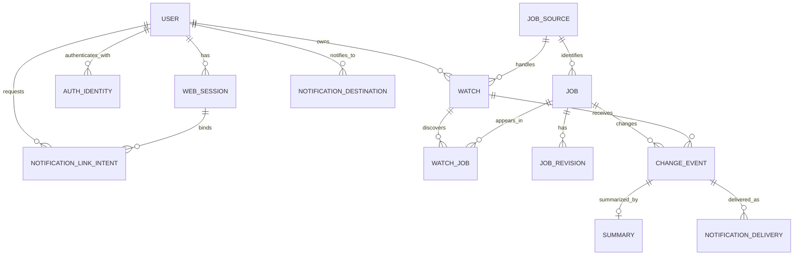

# 求人監視データモデル

- 状態: Draft
- 対象: 求人変更監視の永続データ

## 背景・制約

求人内容は項目別に構造化しない。詳細ページの生HTMLは保存せず、サイト固有のallowlistで抽出・正規化した求人固有HTMLだけを版として保持する。サイト内求人IDはサイト間で衝突し得るため、求人の主キーには使用せず、`source_key`との複合一意制約を設ける。

## 全体構成

## コンポーネントと責務

| エンティティ | 主な属性 | 制約・用途 |
| --- | --- | --- |
| `user` | `id`, `status`, `timezone`, `created_at` | 利用者。外部プロバイダーのIDを主キーにしない。 |
| `auth_identity` | `id`, `user_id`, `provider_key`, `subject`, `created_at`, `last_login_at` | JobHunterログイン用の外部認証ID。初期providerは`google`。`(provider_key, subject)`を一意にし、メールアドレスを同一性キーにしない。 |
| `web_session` | `id`, `user_id`, `expires_at`, `revoked_at`, `created_at` | ログインセッション。cookieには推測不能な参照値だけを設定する。 |
| `notification_link_intent` | `id`, `user_id`, `web_session_id`, `channel_key`, `purpose`, `state_hash`, `nonce_hash`, `expires_at`, `consumed_at` | ログイン済み利用者が開始した通知先連携要求。短時間・1回限りで、初期用途は`ENABLE_LINE_NOTIFICATION`。 |
| `notification_destination` | `id`, `user_id`, `channel_key`, `external_recipient_id`, `status`, `last_verified_at` | LINE等の通知先。`(channel_key, external_recipient_id)`を一意にする。状態は`PENDING_LINK`、`ACTION_REQUIRED`、`ACTIVE`、`BLOCKED`、`DISABLED`。 |
| `job_source` | `key`, `display_name`, `enabled`, `policy` | 求人サイト設定。`key`は`atgp`などの安定識別子。 |
| `watch` | `id`, `user_id`, `source_key`, `search_url`, `interval`, `next_run_at`, `status` | 登録された検索結果URL。`interval`は`12h`または`24h`。`(user_id, source_key, search_url)`に一意制約を設ける。 |
| `job` | `id`, `source_key`, `external_job_id`, `detail_url`, `current_revision_id`, `is_deleted`, `state_generation`, `deleted_at`, `last_checked_at` | 求人の現在状態。`(source_key, external_job_id)`を一意にする。`state_generation`は有効・削除の実状態遷移ごとに増加する。 |
| `watch_job` | `watch_id`, `job_id`, `first_seen_at`, `last_seen_at` | どの監視検索で発見したか。`(watch_id, job_id)`を一意にする。検索結果から消えただけでは削除しない。 |
| `job_revision` | `id`, `job_id`, `sequence`, `detail_url`, `content_html`, `content_hash`, `extractor_version`, `fetched_at` | 求人固有canonical HTMLの不変版。`(job_id, sequence)`を一意にする。ページ全体の生HTMLは保存しない。 |
| `change_event` | `id`, `type`, `job_id`, `watch_id`, `before_revision_id`, `after_revision_id`, `deduplication_key`, `occurred_at` | `NEW`, `UPDATED`, `DELETED`, `RELISTED`。重複排除キーを一意にする。 |
| `summary` | `event_id`, `status`, `content`, `attempt_count`, `last_error` | Codex CLIの要約結果。イベントと1対1。 |
| `notification_delivery` | `id`, `event_id`, `notification_destination_id`, `status`, `attempt_count`, `next_attempt_at` | イベントと通知先の組を一意にする。 |
| `work_item` | `id`, `kind`, `deduplication_key`, `payload`, `available_at`, `lease_until`, `attempt_count`, `status` | 検索取得、詳細取得、要約、通知の永続作業キュー。 |

求人固有canonical HTMLはSQLite内に保存する前提で開始する。SQLAlchemyのORMモデルとSessionを永続化層へ集約する。計測の結果、DBファイル容量やバックアップ時間が問題になった場合だけ、`job_revision.content_html`をオブジェクトストレージ参照へ置き換える。

## データフロー

変更検知時は、次を1トランザクションで行う。

1. SQLiteの短い書き込みトランザクションを開始し、対象`job`の直前状態を再確認する。
2. 必要なら`job_revision`を追加し、`job.current_revision_id`を更新する。
3. `job.is_deleted`と日時を更新する。
4. 一意な`deduplication_key`で`change_event`を追加する。
5. 要約または通知の`work_item`を追加する。

主要な重複排除キーは次の形式とする。文字列形式そのものは実装時に固定する。

| イベント | キーを構成する値 |
| --- | --- |
| 新着 | `watch_id`, `job_id`, 最初の`revision_id` |
| 更新 | `watch_id`, `job_id`, `after_revision_id` |
| 削除 | `watch_id`, `job_id`, `state_generation` |
| 再掲載 | `watch_id`, `job_id`, 再掲載後の`revision_id` |

求人更新・削除は求人単位で1回検知し、その求人を有効に監視する各`watch`へイベントを展開する。これにより外部アクセスとHTML版は共有しながら、利用者ごとの通知履歴を分離する。

## 品質特性

- 外部サイトのIDを内部主キーから分離し、サイト追加やID形式変更の影響を限定する。
- 求人固有HTML版を不変にして、更新前後の再要約と判定根拠の追跡を可能にする。
- 外部副作用を`work_item`へ記録してから実行し、プロセス停止時のイベント欠落を防ぐ。
- `content_html`とエラー本文を機密データ同様に扱い、通常ログへ出力しない。
- SQLiteのforeign key enforcementを接続ごとに有効化し、一意制約をDBでも保証する。

## 関連ADR

- [0001 求人サイト差異を明示的なアダプターで分離する](./adr/0001-explicit-source-adapters.md)
- [0002 Flask、Jinja2、SQLAlchemy、SQLiteを採用する](./adr/0002-flask-jinja-sqlalchemy-sqlite.md)
- [0003 認証プロバイダーと通知チャネルを分離する](./adr/0003-separate-authentication-and-notification.md)
- [0004 検索一覧は新着発見に限定し求人固有コンテンツを保存する](./adr/0004-search-discovery-and-job-content.md)
- [0005 Google認証と任意のLINE通知連携を採用する](./adr/0005-google-auth-line-notification-link.md)

## 未決事項

- 求人固有HTMLの圧縮方式と最大保存サイズ
- 版、イベント、配信履歴の保持期間
- 論理削除求人の再確認を継続する期間
