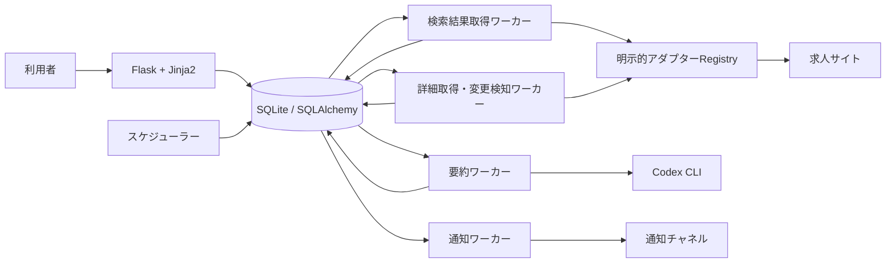
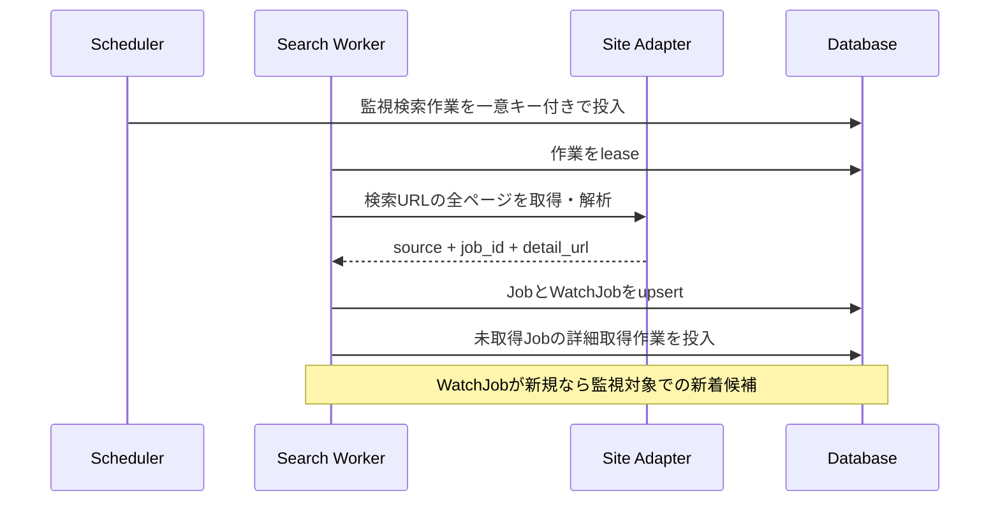

# 求人変更監視システム

- 状態: Draft
- 対象: JobHunter

## 背景・制約

利用者が登録した複数求人サイトの検索結果URLを定期監視する。保存する求人内容は構造化せず、サイト内求人ID、詳細URL、HTML、比較用ハッシュを正本とする。外部サイトはHTML構造、ページネーション、掲載終了表示、アクセス制限が異なるため、これらの差異を求人サイトアダプターへ閉じ込める。

初期構成は、FlaskとJinja2によるWebアプリケーション、同じPythonコードベースを使う複数の定期処理ワーカー、SQLAlchemyを介したSQLiteからなるモジュラーモノリスとする。永続キューはSQLite内の作業テーブルで実現し、運用対象を増やさずに処理境界と再実行性を確保する。

## 全体構成

Webアプリケーションと定期処理は同じアプリケーションサービスを利用するが、外部HTTP取得やCodex CLI実行をWebリクエスト内では行わない。初期構成ではスケジューラーを1つ、ワーカーを複数起動できる。ワーカーは外部処理を並行実行し、SQLiteへの短い書き込みはWAL上で直列化される。複数ホストへの展開が必要になった場合は、並行書き込みに適したDBMSへの移行を先に行う。

## コンポーネントと責務

| コンポーネント | 責務 | 責務外 |
| --- | --- | --- |
| Flask Web / Jinja2 | URL登録画面、監視状態・変更履歴の表示、HTTP入力検証 | 外部サイト取得、Codex CLI実行 |
| 監視設定 | URL検証、アダプター特定、監視間隔と通知先の管理 | HTML解析、変更判定 |
| スケジューラー | 期限を迎えた監視検索と詳細確認の作業を冪等に投入 | 外部HTTP通信 |
| HTTP取得基盤 | タイムアウト、User-Agent、レート制限、再試行、レスポンス上限 | サイト固有のDOM解釈 |
| 求人サイトアダプター | URL適合判定、検索結果解析、ページネーション、ID抽出、詳細状態判定、比較用HTML正規化 | 永続化、通知 |
| 検索結果取得 | 検索ページ巡回、求人候補の重複排除、監視対象との関連付け | 更新・削除の確定 |
| 詳細取得・変更検知 | 詳細ページ取得、ハッシュ比較、版・論理削除・変更イベントの原子的保存 | 要約文生成、通知配信 |
| 要約 | イベントに対応するHTML版をCodex CLIへ渡し、型付き結果を保存 | 変更判定 |
| 通知 | 宛先解決、メッセージ整形、再試行、重複抑止 | 求人サイト取得 |
| 永続化 | 監視設定、求人、HTML版、イベント、作業、配信履歴の保持 | サイト固有処理 |

依存方向は、アプリケーション処理から `JobSourceAdapter`、`PageFetcher`、`Summarizer`、`NotificationChannel` の各ポートへ向ける。具象実装は起動時にコードで明示登録し、実行時探索やリフレクションは使わない。

## データフロー

### 検索と新着

詳細ページを正常取得できた時点で最初の `JobRevision` を保存する。検索結果にリンクが存在しても詳細取得に失敗した求人は通知せず、作業を再試行する。既に別の監視URLで詳細取得済みの求人では、新しい`WatchJob`の作成と同じトランザクションで既存の現在版を参照する新着イベントを生成する。これにより、新しい監視対象の利用者にとっての新着を外部への重複アクセスなしで通知できる。

### 更新と削除

詳細確認は検索処理から分離し、同じ求人が複数の監視対象に含まれても1回だけ取得する。有効な詳細ページではアダプターが比較対象を正規化し、SHA-256ハッシュを計算する。直前版と異なる場合だけ新しい版と更新イベントを保存する。

404またはアダプターが明示的な掲載終了ページと判定した場合だけ論理削除する。タイムアウト、DNS障害、401、403、429、5xx、想定外HTMLは取得失敗として再試行し、求人状態を維持する。

### 要約と通知

変更イベントは状態更新と同じトランザクションで作成する。要約ワーカーは新着なら現在版、更新なら直前版と現在版を読み、HTMLをデータとしてCodex CLIへ渡す。要約成功後に通知作業を作成する。削除は要約を必須とせず、求人IDとURLを通知する。

Codex CLIは固定したプロンプトテンプレートと出力スキーマで非対話実行する。HTML内の命令は無視するよう境界を明示し、入力サイズ、実行時間、出力サイズを制限する。失敗時は指数バックオフで再試行し、上限超過後は要約失敗として隔離する。変更イベント自体は失わない。

## 品質特性

| 特性 | 方針 |
| --- | --- |
| 拡張性 | サイト差異を1アダプターへ集約し、共通契約とHTML fixtureで検証する。 |
| 信頼性 | SQLite作業キュー、lease、冪等キー、トランザクショナルoutboxで少なくとも1回実行を安全に扱う。 |
| SQLite同時実行 | WALと`busy_timeout`を設定し、複数ワーカーの外部処理を並行化する。書き込みは短いトランザクションとして直列化し、`SQLITE_BUSY`を上限付きで再試行する。 |
| 誤検知抑制 | サイト固有の動的領域を除外してからハッシュ化し、取得失敗と削除を区別する。 |
| 礼節・適法性 | robots.txt、利用規約、レート制限をサイト単位で設定し、同一サイトへのアクセスを調停する。 |
| セキュリティ | URLのschemeとhostを許可リスト検証してSSRFを防止し、HTMLを不信入力として隔離する。 |
| 観測性 | `source_key`、`watch_id`、`job_id`、`work_id`、`event_id`を構造化ログの相関キーにする。 |
| 運用容易性 | 失敗作業を再実行でき、監視対象またはサイト単位で停止できる。 |

## 関連ADR

- [0001 求人サイト差異を明示的なアダプターで分離する](./adr/0001-explicit-source-adapters.md)
- [0002 Flask、Jinja2、SQLAlchemy、SQLiteを採用する](./adr/0002-flask-jinja-sqlalchemy-sqlite.md)

## 未決事項

- サイトごとのアクセス許可確認結果と取得設定
- 初回同期の通知方針
- Pythonと各ライブラリの対応バージョン、マイグレーション手段、本番用WSGIサーバー
