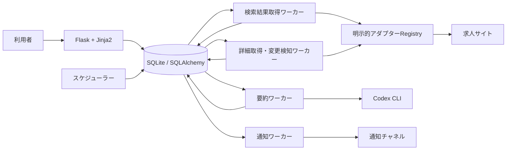
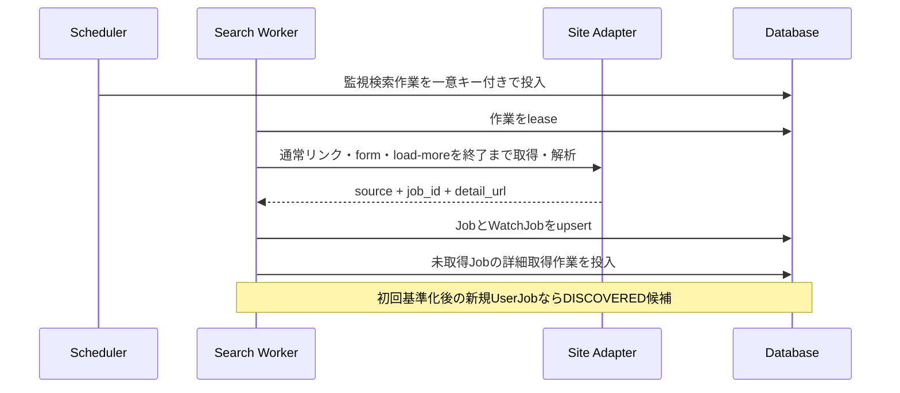

# 求人変更監視システム

- 状態: Draft
- 対象: JobHunter

## 背景・制約

利用者が登録した複数求人サイトの検索結果URLを定期監視する。保存する求人内容は構造化せず、サイト内求人ID、詳細URL、詳細ページから抽出・正規化した求人固有HTML、比較用ハッシュを正本とする。外部サイトはHTML構造、ページネーション、掲載終了表示、アクセス制限が異なるため、これらの差異を求人サイトアダプターへ閉じ込める。

初期構成は、FlaskとJinja2によるWebアプリケーション、同じPythonコードベースを使う複数の定期処理ワーカー、SQLAlchemyを介したSQLiteからなるモジュラーモノリスとする。永続キューはSQLite内の作業テーブルで実現し、運用対象を増やさずに処理境界と再実行性を確保する。

## 全体構成

Webアプリケーションと定期処理は同じアプリケーションサービスを利用するが、外部HTTP取得やCodex CLI実行をWebリクエスト内では行わない。初期構成ではスケジューラーを1つ、ワーカーを複数起動できる。ワーカーは外部処理を並行実行し、SQLiteへの短い書き込みはWAL上で直列化される。複数ホストへの展開が必要になった場合は、並行書き込みに適したDBMSへの移行を先に行う。

## コンポーネントと責務

| コンポーネント | 責務 | 責務外 |
| --- | --- | --- |
| Flask Web / Jinja2 | URL登録画面、監視状態・求人の現在状態の表示、HTTP入力検証 | 外部サイト取得、Codex CLI実行 |
| 監視設定 | URL検証、アダプター特定、監視間隔と通知先の管理 | HTML解析、変更判定 |
| スケジューラー | 期限を迎えた監視検索と詳細確認の作業を冪等に投入 | 外部HTTP通信 |
| ページ取得基盤 | HTTP・ブラウザー取得、タイムアウト、User-Agent、レート制限、再試行、レスポンス上限 | サイト固有のDOM解釈 |
| 求人サイトアダプター | URL適合判定、検索結果解析、ページ巡回指示、ID抽出、詳細状態判定、求人タイトルと求人固有領域の抽出・正規化 | 永続化、通知 |
| 検索結果取得 | 通常リンク・form・load-moreの完全巡回、新規求人候補の重複排除、利用者所有の監視設定との関連付け | 更新・削除の確定 |
| 詳細取得・変更検知 | 求人固有HTMLの抽出、ハッシュ比較、版・論理削除・変更イベントの原子的保存 | 要約文生成、通知配信 |
| 要約 | イベントに対応するHTML版をCodex CLIへ渡し、型付き結果を保存 | 変更判定 |
| 通知 | 利用者の通知時刻ごとのダイジェスト作成、宛先解決、メッセージ整形、再試行、重複抑止 | 求人サイト取得 |
| 永続化 | 監視設定、求人、現在版・直前版、処理中のイベント、作業、最新配信結果の保持 | サイト固有処理 |

依存方向は、アプリケーション処理から `JobSourceAdapter`、`PageFetcher`、`Summarizer`、`NotificationChannel` の各ポートへ向ける。具象実装は起動時にコードで明示登録し、実行時探索やリフレクションは使わない。

## データフロー

### 検索と利用者向け発見

一覧巡回が正常に終了した場合だけ、新しく発見した求人IDを確定する。途中失敗時は部分結果を破棄して再試行し、安全上限到達時は部分結果を破棄して監視設定を要対応として停止する。監視設定の初回巡回は基準化として求人との関連を保存するが、`DISCOVERED`イベントと通知を生成しない。初回基準化後、ある利用者にとって未知の求人を正常取得できた時点で、利用者と求人の組につき1件の`DISCOVERED`イベントを作成する。同じ求人がその利用者の複数の監視設定に該当する場合は、該当する監視設定をイベントへ関連付けるがイベントを複製しない。

詳細ページから求人タイトルと求人固有HTMLを正常抽出できた時点で最初の`JobRevision`を保存する。タイトルまたは求人固有領域を抽出できない求人は通知せず、作業を再試行する。既に別の監視設定で詳細取得済みの求人では、保存済みの現在版を利用者向け発見の要約に再利用する。

### 更新と削除

検索結果一覧は利用者向け発見にだけ使い、一覧から既存求人IDが消えても削除しない。詳細確認は検索処理から分離し、同じ求人が複数の監視設定に含まれる場合は、有効な監視設定の最短間隔で求人単位に1回だけ取得する。有効な詳細ページではアダプターが求人タイトルを抽出するとともに、求人固有領域だけをcanonical HTMLへ変換し、そのUTF-8バイト列からSHA-256ハッシュを計算する。タイトルは正常取得ごとに最新値へ更新するがハッシュには含めず、canonical HTMLが直前版と異なる場合だけ新しい版と求人単位の更新イベントを保存する。

アダプターが200応答などからサイト固有の明確な掲載終了表示を判定した場合は、1回の確認で論理削除する。HTTP 404は削除確認中として記録し、間隔を空けた次回の詳細確認でも404だった場合に論理削除する。確定前に有効な求人ページへ戻った場合は削除確認を解除し、イベントを生成しない。タイムアウト、DNS障害、401、403、429、5xx、掲載終了表示も求人固有領域も抽出できないHTMLは取得・解析失敗として再試行し、求人状態を維持する。

### 要約と通知

求人状態イベントは求人の状態更新と同じトランザクションで、利用者や監視設定の数にかかわらず1件だけ作成する。イベントに該当する利用者ごとに、該当する監視設定のうち最も早い次回通知時刻を持つ通知ダイジェストへ求人単位の項目を追加または更新する。同じ求人に複数イベントが発生した場合は最新状態へ集約し、新着後に掲載終了した求人は通知項目から除外する。

要約ワーカーは、求人の現在版ごとに利用者間で共有する現在要約を生成し、LINE通知の状態にかかわらずWeb表示へ使用する。通知時刻が近づいた更新項目では、利用者へ最後に通知した版と最新の版から変更要約を別に生成する。要約の最終失敗時は、機械抽出した求人タイトルと求人URLを使って通知またはWeb表示する。掲載終了は要約を必須としない。

通知ワーカーは同じ利用者の新着、更新、掲載終了を1回のダイジェストへまとめ、チャネルの上限を超える場合だけ複数メッセージへ分割する。LINE通知がOFFの利用者には外部配信と変更要約を作成せず、後からONにしても過去イベントを遡って配信しない。

Codex CLIは固定したプロンプトテンプレートと出力スキーマで非対話実行する。HTML内の命令は無視するよう境界を明示し、入力サイズ、実行時間、出力サイズを制限する。失敗時は指数バックオフで再試行し、上限超過後は要約失敗として機械抽出情報へフォールバックする。変更イベントは通知処理が完了するまで失わない。

要約入力が1回の上限を超える場合は、canonical HTMLを見出し・項目単位で決定的に分割し、部分要約を最終要約へ統合する。比較用ハッシュは分割せず全canonical HTMLから計算する。分割後の合計処理量、日次・月次利用量、1回の入出力または実行時間が上限へ達した場合は、Codex CLIを追加実行せず求人タイトルとURLへフォールバックする。利用枠の更新後は新しく発生した要約から通常処理へ戻す。

求人HTMLは通常、現在版と直前版だけを保持する。未処理または再試行中の通知が参照する版は処理完了まで保持する。イベント、要約、配信記録は全配信が成功または最終失敗になった後に整理し、最新の完了結果だけを残す。

監視設定を停止した場合はその検索作業を投入せず、他の有効な監視設定からも参照されない求人は詳細確認を停止する。再開時は現在の検索結果と求人状態を通知なしで再基準化し、停止期間中の変化を遡って通知しない。

新しい監視設定の既定間隔は24時間とする。検索巡回がサイト別の最大ページ数または最大求人件数へ達した場合は部分結果を破棄し、監視設定を`NEEDS_ATTENTION`として停止する。利用者が検索条件を修正して再開した場合は通知なしで再基準化する。

通常通知枠は利用者のタイムゾーンで、24時間設定は毎日9:00、12時間設定は毎日9:00と21:00に固定する。通常枠までに要約未完了などで通知可能にならなかったイベントは遅延分として蓄積し、1時間ごとに別の遅延ダイジェストへまとめる。22:00から翌8:00までは外部配信を休止するが、取得、変更検知、要約、再試行は続ける。休止時間中の遅延分は8:00以降の最初の確認でまとめる。

掲載終了が確定した求人は単独の定期詳細確認を停止する。有効な監視設定の検索結果へ同じ求人IDが再出現した場合だけ詳細を取得し、有効なページなら再掲載として扱う。

サイトアダプターの`extractor_version`を更新した場合は、対象サイトの求人について新旧ハッシュを比較せず、通知なしで再基準化する。再基準化中は対象サイトの更新通知を停止し、失敗した求人は旧版を維持して個別に再試行する。全対象求人の再基準化が完了してから通常の変更検知を再開する。

同じ求人サイトで`UNEXPECTED`、タイトル抽出失敗、求人固有領域の抽出失敗が設定回数または設定割合を超えた場合は、サイト単位のサーキットブレーカーを開く。停止中はそのサイトの取得と状態確定を行わず、監視設定は維持してサイト障害中と表示する。アダプター修正後に通知なしで再基準化し、成功後に通常監視へ戻す。

利用規約やrobots.txtなどの取得許可条件が変更された場合は、そのサイトの新規監視登録と全取得を停止する。既存求人を掲載終了扱いにせず最後の確認状態、タイトル、現在要約、URLを維持する。再許可を確認できた場合だけ通知なしの再基準化後に再開する。

アカウント削除時は利用者固有の認証、セッション、監視設定、通知先、求人関連、未送信ダイジェスト、処理中作業を削除または中止する。他利用者が参照する共有求人データは維持し、参照も処理中作業もない求人は削除する。

## 品質特性

| 特性 | 方針 |
| --- | --- |
| 拡張性 | サイト差異を1アダプターへ集約し、共通契約とHTML fixtureで検証する。 |
| 信頼性 | SQLite作業キュー、lease、冪等キー、トランザクショナルoutboxで少なくとも1回実行を安全に扱う。 |
| SQLite同時実行 | WALと`busy_timeout`を設定し、複数ワーカーの外部処理を並行化する。書き込みは短いトランザクションとして直列化し、`SQLITE_BUSY`を上限付きで再試行する。 |
| 誤検知抑制 | allowlistで求人固有領域だけを抽出・正規化してハッシュ化し、抽出失敗と削除を区別する。 |
| 礼節・適法性 | robots.txt、利用規約、レート制限をサイト単位で設定し、同一サイトへのアクセスを調停する。 |
| セキュリティ | URLのschemeとhostを許可リスト検証してSSRFを防止し、HTMLを不信入力として隔離する。 |
| 観測性 | `source_key`、`watch_id`、`job_id`、`work_id`、`event_id`を構造化ログの相関キーにする。 |
| 運用容易性 | 失敗作業を再実行でき、監視対象またはサイト単位で停止できる。 |
| 障害隔離 | 解析失敗の急増時はサイト単位のサーキットブレーカーで取得と状態確定を停止し、他サイトの処理を継続する。 |
| コスト制御 | Codex CLIの1回、日次、月次の利用上限を設け、上限到達時は機械抽出情報へフォールバックする。 |

## 関連ADR

- [0001 求人サイト差異を明示的なアダプターで分離する](./adr/0001-explicit-source-adapters.md)
- [0002 Flask、Jinja2、SQLAlchemy、SQLiteを採用する](./adr/0002-flask-jinja-sqlalchemy-sqlite.md)
- [0004 検索一覧は利用者向け発見に限定し求人固有コンテンツを保存する](./adr/0004-search-discovery-and-job-content.md)
- [0006 求人状態イベントと利用者向け発見を分離する](./adr/0006-separate-job-events-and-user-discovery.md)
- [0007 求人履歴は変更検知と処理中通知に必要な範囲だけ保持する](./adr/0007-retain-only-required-job-history.md)

## 未決事項

- サイトごとのアクセス許可確認結果と取得設定
- Pythonと各ライブラリの対応バージョン、マイグレーション手段、本番用WSGIサーバー
