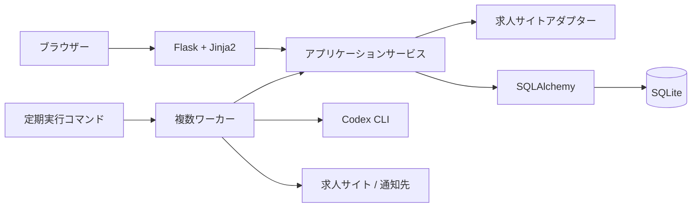

# 技術スタック

- 状態: Accepted
- 対象: JobHunter

## 背景・制約

初期リリースは単一ホストで運用できる小規模なWebアプリケーションとし、利用者が監視URLと通知設定を管理できる画面、定期取得、変更検知、Codex CLI要約、通知を同じPythonコードベースで実装する。

複数ワーカーで外部HTTP取得やCodex CLI実行を並行化する。SQLiteのWALでは読み取りと書き込みを並行実行できるが、書き込みトランザクションは1つずつ処理される。このため外部処理中にデータベーストランザクションを保持せず、結果確定の書き込みを短く保つ。

## 全体構成

| レイヤー | 採用技術 | 用途 |
| --- | --- | --- |
| フロントエンド | Jinja2 | Flaskから配信するサーバーサイドHTMLテンプレート |
| バックエンド | Python / Flask | HTTPルーティング、フォーム処理、アプリケーションサービス、CLIエントリーポイント |
| 永続化 | SQLite / SQLAlchemy | 監視設定、求人、HTML版、イベント、作業、通知履歴 |

## コンポーネントと責務

### FlaskとJinja2

- Flaskのapplication factoryで設定と依存関係を組み立てる。
- 画面領域ごとにBlueprintを明示登録する。
- routeはHTTP入力の検証、アプリケーションサービスの呼び出し、レスポンス生成だけを担当する。
- Jinja2テンプレートへORMエンティティを直接渡さず、画面用view modelへ変換する。
- 求人サイトから取得したHTMLをJinja2の`safe`指定で表示しない。必要な場合は別途サニタイズ方式を決定する。
- 定期取得やCodex CLIをHTTPリクエスト内で実行しない。

### SQLAlchemyとSQLite

- SQLAlchemyのSessionをWebリクエストまたはワーカーの1処理単位で生成し、処理間で共有しない。
- ORMモデルと求人サイトアダプターを分離し、HTML解析処理からSessionを参照しない。
- SQLiteではforeign key enforcementを接続時に有効化する。
- journal modeはWAL、`busy_timeout`を設定し、読み取りと短い書き込みの競合を抑える。
- 外部HTTP通信、Codex CLI実行、通知送信はトランザクション外で行い、結果確定時だけ短いトランザクションを開始する。
- 求人変更の確定は書き込みトランザクション開始後に現在状態を再確認する。SQLiteで効果のない行ロックや`SKIP LOCKED`を前提にしない。
- 複数ワーカーの書き込みはSQLiteにより直列化される。`busy_timeout`を超えた`SQLITE_BUSY`は、処理全体の冪等性を保ったまま上限付きで再試行する。
- DBファイルはWebサーバーとワーカーが参照できる同一ホストの永続領域へ置き、ネットワークファイルシステム上には置かない。

### 定期処理

- スケジューラーの起動方式にかかわらず、Flask CLIから1回分の期限切れ作業を実行できるコマンドを提供する。
- 初期構成ではスケジューラーを1つ、作業を処理するワーカーを複数起動できる。
- ワーカー数は、求人サイトの同時接続制限、Codex CLIの同時実行上限、SQLiteのロック待ち時間を計測して設定する。
- 作業ごとのleaseと重複排除キーは残し、異常終了後の再開を可能にする。
- 同一ホスト内ではワーカー並列度を増減できる。複数ホストへの水平展開または継続的な書き込み競合が必要になった場合は、サーバー型DBMSへの移行を判断する。

## データフロー

Web画面からの監視URL登録は、Flask route、アプリケーションサービス、SQLAlchemy repositoryの順で処理する。登録後の取得作業は永続作業キューへ追加し、Webレスポンスとは独立してワーカーが処理する。

ワーカーは外部処理に必要なデータを短い読み取りで取得してSessionを閉じ、外部処理を実行した後、新しいSessionと短い書き込みトランザクションで結果を確定する。

## 品質特性

| 特性 | 方針 |
| --- | --- |
| 単純性 | Python、Flask、Jinja2、SQLAlchemy、SQLiteからなる単一コードベース・単一ホスト構成とする。 |
| テスト容易性 | route、アプリケーションサービス、アダプター、repositoryを分離し、Flask test clientと一時SQLite DBで検証する。 |
| 整合性 | foreign key、一意制約、短い書き込みトランザクション、冪等キーを使用する。 |
| 将来移行 | SQLAlchemyへDBアクセスを集約する。ただしSQLite固有設定はインフラ層へ隔離し、DBMS移行は別ADRで判断する。 |
| セキュリティ | Jinja2の自動エスケープを維持し、取得HTMLをテンプレートへ直接描画しない。 |

## 関連ADR

- [0002 Flask、Jinja2、SQLAlchemy、SQLiteを採用する](./adr/0002-flask-jinja-sqlalchemy-sqlite.md)

## 未決事項

- Pythonと各ライブラリの対応バージョン
- DBスキーママイグレーション手段
- 定期的にFlask CLIを起動するOS側スケジューラー
- 本番用WSGIサーバー
- フォームのCSRF対策と認証方式
