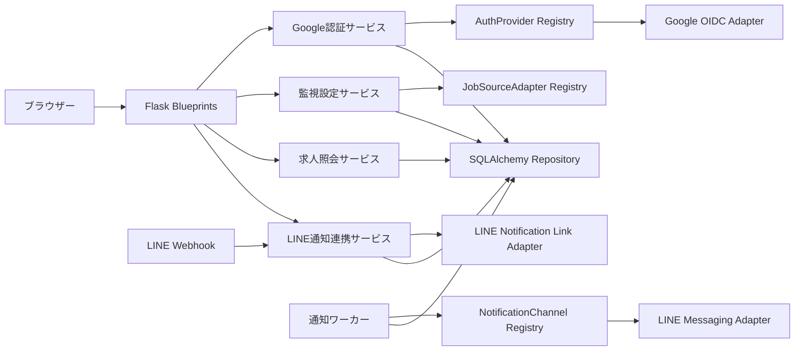
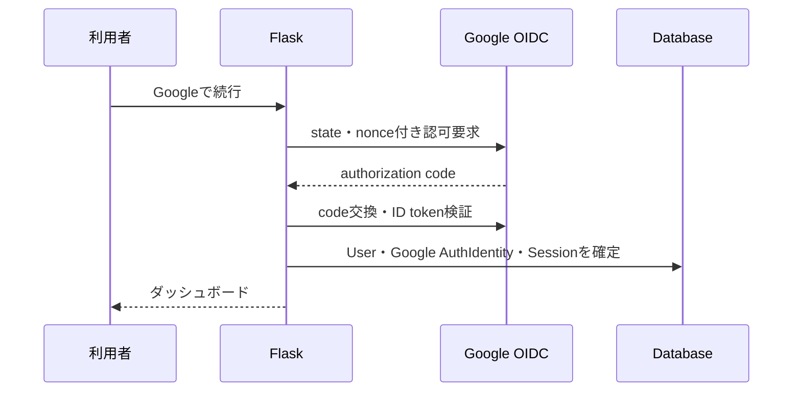
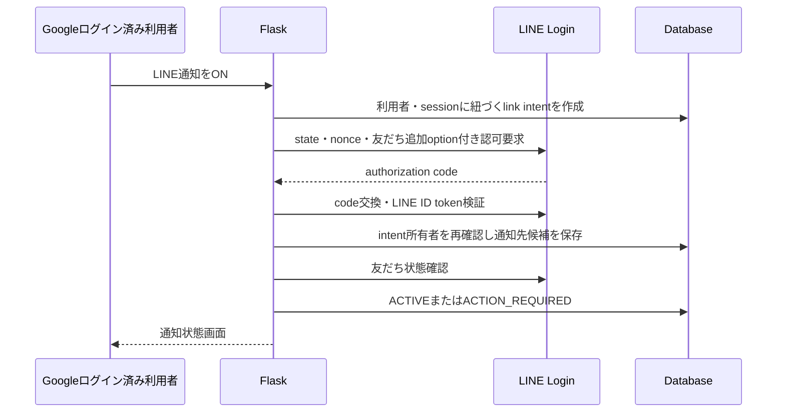

# Webバックエンド

- 状態: Draft
- 対象: FlaskによるGoogle認証、監視設定、求人閲覧、LINE通知連携

## 背景・制約

JobHunterの会員登録とログインにはGoogle OpenID Connectを使用する。LINE LoginをJobHunterへのログイン方式として使用しない。

LINEは利用者がLINE通知をONにした場合だけ連携する。Googleログイン済みの内部利用者とLINE user IDを安全に関連付け、LINE公式アカウントを友だち追加済みの場合に通知を有効化する。Google認証とLINE通知連携は、異なる目的、状態、解除条件を持つため別コンポーネント・別DBエンティティとして扱う。

## 全体構成

`AuthenticationProvider`はJobHunterへログインする外部認証、`NotificationLinkProvider`は通知先の本人確認と関連付け、`NotificationChannel`はメッセージ送信を担当する。3つを独立した型付きポートとし、composition rootで静的に登録する。

## コンポーネントと責務

### Google会員登録・ログイン

`AuthenticationProvider`は次の責務を持つ。

| 操作 | 責務 |
| --- | --- |
| `begin_authorization` | state、nonceを含むGoogle認可要求を作成する。 |
| `complete_authorization` | authorization codeを交換し、ID tokenを検証してprovider内subjectと許可されたプロフィールを返す。 |
| `revoke` | 対応可能な場合に認証連携解除処理を行う。 |

GoogleではAuthorization Code Flowを使用し、state、nonce、redirect URI、ID tokenの署名、issuer、audience、有効期限を検証する。Google ID tokenの`sub`を`auth_identity.subject`とし、メールアドレスを利用者の同一性キーにしない。

共通認証サービスは`(provider_key=google, subject)`から`auth_identity`を検索する。存在しなければ利用規約等への同意確認後に`user`と`auth_identity`を同じトランザクションで作成し、存在すれば`last_login_at`を更新する。

外部から渡された`next`は同一originの相対パスだけを許可する。認証一時値は短時間で失効し、1回だけ使用できるようにする。

ログインセッションには内部`user_id`とセッション識別子だけを関連付ける。cookieには`Secure`、`HttpOnly`、適切な`SameSite`、有効期限を設定し、ログアウトと認証情報失効時にサーバー側セッションを無効化できる構成とする。

LINE Login callbackから`user`や`auth_identity`を作成してはならない。

### 監視設定

監視設定サービスは、ログイン利用者、検索結果URL、間隔を入力として次を1トランザクションで行う。

1. URLのscheme、host、長さを検証する。
2. 静的な求人サイトアダプターRegistryから担当を1つ特定する。
3. アダプターで検索結果URLを正規化する。
4. 同一利用者の重複を確認する。
5. `watch`を作成し、初回検索の`work_item`を追加する。

間隔は任意数値ではなく`12h`または`24h`の許可値として受け付け、新規作成時の既定値は`24h`とする。変更時は最終成功時刻を基準に次回予定を再計算し、過去になる場合は即時実行可能時刻とする。

検索巡回がサイト別安全上限へ達した場合は部分結果を破棄し、監視設定を`NEEDS_ATTENTION`へ移す。利用者が検索結果URLを修正すると、URLの検証、アダプター特定、正規化、重複確認を再実行してから通知なしの再基準化作業を投入する。

求人サイトのサーキットブレーカーが開いている場合は、そのサイトに属する監視設定をサイト障害中として返す。取得許可を失ったサイトは取得不可として返し、新規登録を拒否する。どちらの場合も既存求人を掲載終了へ変更せず、最後に確認できたタイトル、現在要約、URLを求人照会で返す。

### 求人照会

求人照会サービスは、必ずログイン利用者の`watch`と`user_job`を起点に求人を検索する。クライアントから渡された`job_id`だけで求人を取得しない。

一覧用view modelには求人タイトル、現在版で共有する現在要約、サイト名、掲載状態、最終確認日時を含める。詳細用view modelには求人ID、求人タイトル、詳細URL、現在要約、掲載状態、最終確認日時を含める。LINE通知がOFFでも現在要約を返し、変更履歴と保存HTMLは返さない。

### LINE通知のON

LINE通知連携はGoogleログイン済み利用者が明示的にONを選んだ場合だけ開始する。

1. CSRF検証済みのPOSTで`notification_link_intent`を作成する。
2. intentを内部`user_id`、現在の`web_session`、用途`ENABLE_LINE_NOTIFICATION`、推測不能なstate、nonce、有効期限に結び付ける。
3. LINE LoginのAuthorization Code Flowへリダイレクトする。このLINE Loginは通知先の本人確認専用であり、JobHunterへのログインではない。
4. LINE callbackでstate、nonce、ID tokenを検証し、intentの利用者と現在のGoogleログインセッションが一致することを確認する。
5. LINEのsubjectを`notification_destination.external_recipient_id`として関連付ける。
6. 友だち状態を確認し、友だち追加済みなら`ACTIVE`、未追加またはブロック中なら`ACTION_REQUIRED`にする。

LINE LoginチャネルとMessaging APIチャネルは同じLINE Provider配下に作成する。同じProvider配下では同じ利用者に同じLINE user IDが発行されるため、LINE Loginで確認したsubjectをMessaging APIの通知先として使用できる。

LINE Loginのadd friend optionを設定して認可中に友だち追加を促す。callback後も友だち状態が未完了なら、LINE公式アカウントの友だち追加導線を画面へ表示する。友だち追加は通知を有効化する条件であり、JobHunterへのログイン条件ではない。

同じLINE通知先を複数の内部利用者へ関連付けない。既に別利用者へ関連付いているsubjectでの連携は拒否し、既存の関連を上書きしない。

### LINE通知のOFF

Googleログイン済み利用者がOFFを選んだ場合、対象`notification_destination`を`DISABLED`にして新規配信と利用者別の変更要約生成を停止する。求人版ごとの現在要約はWeb表示用に継続する。Googleの`auth_identity`と`web_session`は変更せず、再度ONにしてもOFF期間中のイベントは遡って配信しない。

LINE公式アカウントの友だち解除は利用者がLINE側で行う。再度ONにする場合は、新しい`notification_link_intent`からLINE本人確認と友だち状態確認をやり直す。

### LINE webhook

LINE webhookはFlaskの専用endpointで受信し、リクエスト生bodyの署名を検証してから非同期作業として保存する。`follow`で該当通知先を`ACTIVE`、`unfollow`で`BLOCKED`にする。webhook event IDを一意に保存して再配信を重複処理しない。

webhookのLINE user IDだけからJobHunter利用者を新規作成しない。既存の`notification_destination`に一致する場合だけ状態を更新する。

### 通知

通知ワーカーは、通知時刻を迎えた利用者のダイジェストについて`ACTIVE`な通知先を選び、`NotificationChannel`へ送信する。初期実装はLINE Messaging APIのpush messageとする。通常通知枠は利用者のタイムゾーンで、24時間設定は9:00、12時間設定は9:00と21:00に固定する。

通知間隔の12時間または24時間は監視設定の確認時刻と通知時刻を表す。変更イベントは検知時に記録し、利用者の通知時刻までに確定した新着、更新、掲載終了を求人単位に集約して1回のダイジェストとして配信する。同じ求人が複数の監視設定に該当する場合は、最も早い次回通知時刻を使用する。

通常枠までに通知可能にならなかったイベントは遅延分として保持し、1時間ごとの作業で別ダイジェストへまとめる。22:00から翌8:00までは外部配信作業を保留し、8:00以降の最初の遅延作業で蓄積分をまとめる。

### アカウント削除

アカウント削除は再認証または直近認証を要求するCSRF検証済みPOSTとして扱う。対象利用者の認証ID、全Webセッション、監視設定、通知先、求人関連、未送信ダイジェストを削除し、利用者向け処理中作業を中止する。他利用者が参照する共有求人は削除せず、参照も処理中作業もない求人だけを後続の削除作業で除去する。

## HTTP境界

| Method | Path | 認証 | 用途 |
| --- | --- | --- | --- |
| GET | `/login` | 不要 | Googleログイン・会員登録画面 |
| GET | `/auth/google/start` | 不要 | Google認可開始 |
| GET | `/auth/google/callback` | 不要 | Google callback検証、会員登録またはログイン |
| POST | `/logout` | 必要 | セッション無効化 |
| GET | `/` | 必要 | ダッシュボード |
| GET | `/watches` | 必要 | 監視対象一覧 |
| GET, POST | `/watches/new` | 必要 | 入力画面と監視対象作成 |
| POST | `/watches/{watch_id}/interval` | 必要 | 間隔変更 |
| POST | `/watches/{watch_id}/search-url` | 必要 | 要対応となった検索条件の修正 |
| POST | `/watches/{watch_id}/stop` | 必要 | 監視停止 |
| POST | `/watches/{watch_id}/resume` | 必要 | 監視再開と通知なしの再基準化 |
| GET | `/jobs` | 必要 | 利用者の求人一覧 |
| GET | `/jobs/{job_id}` | 必要 | 利用者の求人詳細 |
| POST | `/notifications/line/enable` | 必要 | LINE通知連携開始 |
| GET | `/notification-links/line/callback` | 必要 | LINE通知連携callback |
| POST | `/notifications/line/disable` | 必要 | LINE通知をOFF |
| POST | `/account/delete` | 必要・直近認証 | アカウント削除 |
| POST | `/webhooks/line` | LINE署名 | Messaging API webhook |

ブラウザーからの状態変更はCSRF tokenを必須とする。GoogleとLINEのcallbackでは各フローのstateとnonceを検証する。LINE webhookにはブラウザー用CSRFを適用せず、リクエスト生bodyに対するLINE署名検証を必須とする。

## データフロー

### Google会員登録・ログイン

### LINE通知のON

LINE側障害はGoogleログインセッションへ影響させない。友だち状態確認に失敗した場合は通知先を有効化せず、再試行可能な状態で残す。

## 品質特性

| 特性 | 方針 |
| --- | --- |
| 拡張性 | 新しい会員ログインは`AuthenticationProvider`、新しい通知連携は`NotificationLinkProvider`、新しい送信先は`NotificationChannel`へ追加する。 |
| 認可 | repository呼び出しまでに`user_id`を必須化し、監視対象・通知先との所有関係をSQL条件に含める。 |
| セキュリティ | Google OIDC検証、LINE連携intent、CSRF、session fixation対策、LINE webhook署名検証、secretのログ抑止を行う。 |
| 可用性 | Google認証とLINE通知連携を分離し、LINE障害や未連携でログイン不能にしない。 |
| 監査性 | ログイン成功・失敗、LINE通知のON・OFF、通知先状態変更をtokenなしで記録する。 |

## 関連ADR

- [0005 Google認証と任意のLINE通知連携を採用する](./adr/0005-google-auth-line-notification-link.md)

## 未決事項

- Googleプロフィールから保存する表示名・画像の範囲
- セッション識別子の生成・ハッシュ保存方式と有効期限
- LINE通知連携の有効期限と再認証条件
- LINE公式アカウントの友だち追加をadd friend option以外にも表示するか
- 将来追加する会員ログイン方式

## 関連資料

- [Google OpenID Connect API](https://developers.google.com/identity/openid-connect/reference)
- [LINE user IDの発行単位](https://developers.line.biz/en/docs/messaging-api/getting-user-ids/)
- [LINE Loginの友だち状態API](https://developers.line.biz/en/reference/line-login/)
- [LINE公式アカウントの友だち追加](https://developers.line.biz/en/docs/messaging-api/sharing-bot/)
- [LINE webhookの受信と署名検証](https://developers.line.biz/en/docs/messaging-api/receiving-messages/)
