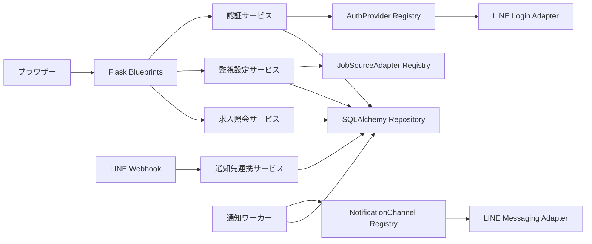
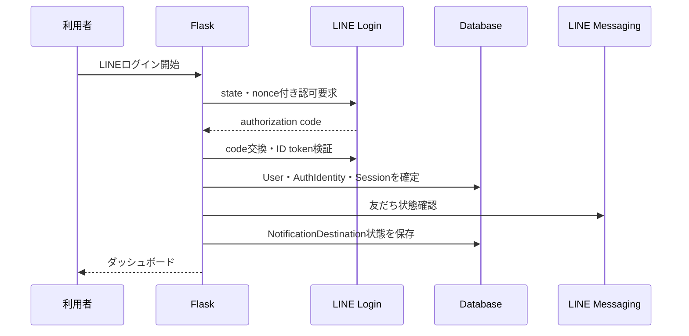

# Webバックエンド

- 状態: Draft
- 対象: Flaskによる認証、監視設定、求人閲覧、通知連携

## 背景・制約

初期ログイン方式と通知チャネルはLINEとする。将来ほかのログイン方式と通知チャネルを追加できるようにするが、認証と通知を同じインターフェースやDB行として扱わない。

LINE Loginは利用者の認証、Messaging APIはLINE通知という別の役割を持つ。同じLINE Provider配下にLINE LoginチャネルとMessaging APIチャネルを作成すると、同じ利用者に同じLINE user IDが発行される。一方、LINEプッシュ通知には公式アカウントの友だち追加などの送信条件があるため、ログイン成功と通知可能状態を分けて管理する。

## 全体構成

認証プロバイダー、通知チャネル、求人サイトアダプターはそれぞれ独立した型付きポートとし、composition rootで静的に登録する。

## コンポーネントと責務

### 認証

`AuthenticationProvider`は次の責務を持つ。

| 操作 | 責務 |
| --- | --- |
| `begin_authorization` | state、nonce、PKCEなどプロバイダーが必要とする認可要求を作成する。 |
| `complete_authorization` | callbackを検証し、プロバイダー内subjectと許可されたプロフィールを返す。 |
| `revoke` | 対応可能な場合に連携解除処理を行う。 |

共通認証サービスは`(provider_key, subject)`から`auth_identity`を検索し、利用者を特定または初回作成する。LINE固有トークンやプロフィール形式をroute、利用者、通知先テーブルへ漏らさない。

LINE LoginではAuthorization Code Flowを使用し、最低限state、nonce、redirect URI、ID tokenの署名・issuer・audience・有効期限を検証する。外部から渡された`next`は同一originの相対パスだけを許可する。認証一時値は短時間で失効し、1回だけ使用できるようにする。

ログインセッションには内部`user_id`とセッション識別子だけを関連付ける。cookieには`Secure`、`HttpOnly`、適切な`SameSite`、有効期限を設定し、ログアウトと認証情報失効時にサーバー側セッションを無効化できる構成とする。

### 監視設定

監視設定サービスは、ログイン利用者、検索結果URL、間隔を入力として次を1トランザクションで行う。

1. URLのscheme、host、長さを検証する。
2. 静的な求人サイトアダプターRegistryから担当を1つ特定する。
3. アダプターで検索結果URLを正規化する。
4. 同一利用者の重複を確認する。
5. `watch`を作成し、初回検索の`work_item`を追加する。

間隔は任意数値ではなく`12h`または`24h`の許可値として受け付ける。変更時は最終成功時刻を基準に次回予定を再計算し、過去になる場合は即時実行可能時刻とする。

### 求人照会

求人照会サービスは、必ずログイン利用者の有効または履歴保持中の`watch`を起点に求人を検索する。クライアントから渡された`job_id`だけで求人を取得しない。

一覧用view modelには変更種別、要約見出し、サイト名、掲載状態、検知日時を含める。詳細用view modelには求人ID、詳細URL、現在の要約、変更履歴、最終確認日時を含める。保存HTMLは返さない。

### LINE通知連携

認証プロバイダーと通知チャネルの対応は`DefaultNotificationProvisioner`の静的マップで定義する。初期値は`line_login -> line_messaging`とする。

LINE LoginチャネルとMessaging APIチャネルは同じLINE Provider配下に作成する。ログインで得たsubjectをLINE通知先候補として保存し、友だち状態を確認できた場合だけ`ACTIVE`にする。通知不可の場合もログインは成功させ、通知先を`ACTION_REQUIRED`として画面へ表示する。

LINE webhookはFlaskの専用endpointで受信し、署名を検証してから非同期作業として保存する。`follow`または利用可能状態の確認で通知先を`ACTIVE`、`unfollow`で`BLOCKED`にする。webhook event IDを一意に保存して再配信を重複処理しない。

### 通知

通知ワーカーは、変更イベントに対応する利用者の`ACTIVE`な通知先を選び、`NotificationChannel`へ送信する。初期実装はLINE Messaging APIのpush messageとする。

通知間隔の12時間または24時間は、監視対象を再確認して変更を検知する間隔を表す。変更検知後の通知は要約完了後に直ちに配信する。複数イベントを12時間または24時間分まとめるダイジェスト通知は別要件とする。

## HTTP境界

| Method | Path | 認証 | 用途 |
| --- | --- | --- | --- |
| GET | `/login` | 不要 | ログイン画面 |
| GET | `/auth/line/start` | 不要 | LINE認可開始 |
| GET | `/auth/line/callback` | 不要 | LINE callback検証 |
| POST | `/logout` | 必要 | セッション無効化 |
| GET | `/` | 必要 | ダッシュボード |
| GET | `/watches` | 必要 | 監視対象一覧 |
| GET, POST | `/watches/new` | 必要 | 入力画面と監視対象作成 |
| POST | `/watches/{watch_id}/interval` | 必要 | 間隔変更 |
| POST | `/watches/{watch_id}/stop` | 必要 | 監視停止 |
| GET | `/jobs` | 必要 | 利用者の求人一覧 |
| GET | `/jobs/{job_id}` | 必要 | 利用者の求人詳細 |
| POST | `/webhooks/line` | LINE署名 | Messaging API webhook |

ブラウザーからの状態変更はCSRF tokenを必須とする。LINE webhookにはブラウザー用CSRFを適用せず、リクエスト生bodyに対するLINE署名検証を必須とする。

## データフロー

友だち状態確認やMessaging API障害はログイン結果をロールバックしない。通知先状態の確認は再試行可能な別作業として扱えるようにする。

## 品質特性

| 特性 | 方針 |
| --- | --- |
| 拡張性 | 新しいログインは`AuthenticationProvider`、新しい通知先は`NotificationChannel`と必要な連携方針を追加する。 |
| 認可 | repository呼び出しまでに`user_id`を必須化し、監視対象との所有関係をSQL条件に含める。 |
| セキュリティ | OAuth/OIDC検証、CSRF、session fixation対策、LINE webhook署名検証、secretのログ抑止を行う。 |
| 可用性 | 認証成功と通知先確認を分離し、通知サービス障害でログイン不能にしない。 |
| 監査性 | ログイン成功・失敗、監視設定変更、通知先状態変更を個人情報やtokenなしで記録する。 |

## 関連ADR

- [0003 認証プロバイダーと通知チャネルを分離する](./adr/0003-separate-authentication-and-notification.md)

## 未決事項

- LINEプロフィールから保存する表示名・画像の範囲
- セッション識別子の生成・ハッシュ保存方式と有効期限
- LINE公式アカウントの友だち追加をログイン画面内で促す方式
- 将来追加するログイン方式と、その方式に対応する既定通知チャネル

## 関連資料

- [LINE user IDの発行単位](https://developers.line.biz/en/docs/messaging-api/getting-user-ids/)
- [LINE Messaging APIのpush message送信条件](https://developers.line.biz/en/reference/messaging-api/)
- [LINE webhookの受信と署名検証](https://developers.line.biz/en/docs/messaging-api/receiving-messages/)
