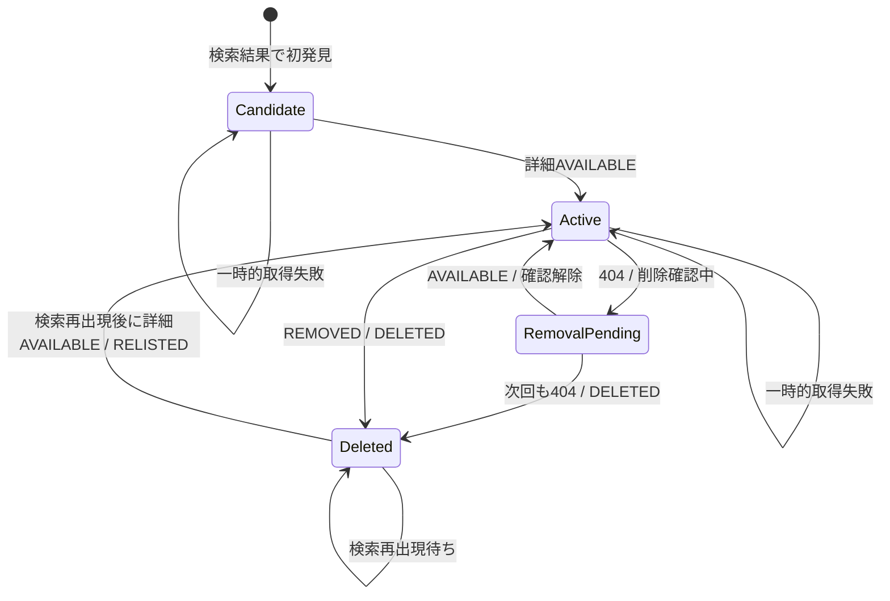

# 求人変更の判定

- 状態: Draft

## 用語

| 用語 | 定義 |
| --- | --- |
| 求人 | `source_key`と`external_job_id`で識別されるサイト内の掲載単位 |
| 初回基準化 | 監視設定の初回取得結果を通知しない比較基準として登録する処理 |
| 利用者向け発見 | 初回基準化の完了後、求人がある利用者の監視結果に初めて現れ、詳細ページを正常取得できた状態 |
| 版 | 変更時に追加保存される求人タイトル、詳細URL、求人固有canonical HTML、比較用ハッシュ、抽出規則の版 |
| 掲載削除 | サイト固有の明確な掲載終了表示、または間隔を空けた2回連続の404によって掲載終了が確定した状態 |
| 再掲載 | 掲載削除済み求人の詳細ページが再び有効と確認された状態 |

## 同一性

- 求人の同一性は`(source_key, external_job_id)`で判定する。
- URLは変更され得る属性であり、同一性には使わない。
- 異なるサイトの同じIDは別求人とする。
- 同じ求人が複数の検索URLに現れた場合、求人とHTML版は共有し、監視対象との関連と通知は分ける。
- 異なる求人サイト間の名寄せは行わない。

## 状態遷移

`Candidate`は未取得作業と`job.current_revision_id`がない状態で表し、独立した求人状態値を必須としない。

## 判定規則

判定は次の優先順とする。

| 優先 | 観測 | 事前状態 | 更新 | イベント |
| --- | --- | --- | --- | --- |
| 1 | 通信失敗、401、403、429、5xx、`UNEXPECTED` | 任意 | 求人状態を維持し、取得失敗を記録 | なし |
| 2 | サイト固有の`REMOVED` | 有効または削除確認中 | `is_deleted=true`、`deleted_at`設定、削除確認を解除 | 求人単位の`DELETED` |
| 3 | 404 | 有効 | 削除確認中として確認日時と回数を記録 | なし |
| 4 | 404 | 削除確認中 | 前回と間隔を空けた別の詳細確認なら`is_deleted=true`、`deleted_at`設定 | 求人単位の`DELETED` |
| 5 | 404または`REMOVED` | 削除済み | 最終確認時刻だけ更新 | なし |
| 6 | `AVAILABLE`かつタイトルと求人固有領域を抽出可能 | 未取得 | 最初の版を追加、有効化。初回基準化中は関連だけを保存 | 初回基準化後に限り利用者と求人の組ごとの`DISCOVERED` |
| 7 | `AVAILABLE` | 削除確認中 | 削除確認を解除し、ハッシュに応じて有効求人と同様に処理 | ハッシュ変更時だけ求人単位の`UPDATED` |
| 8 | `AVAILABLE`かつハッシュ同一 | 有効 | URLと最終確認時刻だけ更新 | なし |
| 9 | `AVAILABLE`かつハッシュ相違 | 有効 | 新しい版を追加 | 求人単位の`UPDATED` |
| 10 | 検索結果へ再出現後に`AVAILABLE` | 削除済み | 必ず新しい版を追加し有効化 | 求人単位の`RELISTED` |

検索結果一覧は利用者向け発見にだけ使用する。検索結果から求人が消えたことだけでは削除と判定しない。無限スクロールやページ巡回の失敗、検索順位変動、検索条件変更による誤削除を避けるため、削除の正本は詳細ページの状態とする。

同一求人の詳細確認は、SQLiteの短い書き込みトランザクション開始後に直前ハッシュと削除状態を再読して確定する。複数ワーカーが同じ求人を処理しても、版とイベントの一意制約により片方だけを確定し、競合した処理は最新状態を再読して終了する。SQLiteでは行ロックや`SKIP LOCKED`を前提にしない。

## 例外

- 詳細URLが変わっても求人IDが同じなら同じ求人としてURLを更新する。
- 求人タイトルは正常取得ごとに最新値へ更新するが比較用ハッシュに含めず、タイトルだけの変化では更新イベントを作成しない。
- 200でログインページ、bot対策ページ、同意画面へ遷移した場合は`UNEXPECTED`であり削除ではない。
- 求人タイトルまたは求人固有領域を抽出できない場合は`UNEXPECTED`であり、空コンテンツへの更新や削除ではない。
- 求人IDが再利用され、内容が全面的に変わってもサイト内IDが同じ限り更新として扱う。再利用が確認されたサイトはアダプター固有規則をADRで追加する。
- `extractor_version`が変わると全求人のハッシュが変わり得る。異なる版を単純比較せず、通知抑止付きで再基準化する。
- 掲載削除確定後は詳細ページを定期確認せず、有効な監視設定の検索結果へ同じ求人IDが再出現した場合だけ再掲載を確認する。
- サイト単位のサーキットブレーカーが開いている間、または取得許可を失っている間は、そのサイトの求人状態とイベントを確定しない。既存求人を掲載終了扱いにしない。

## 冪等性

- 検索作業は`watch_id`と予定時刻で重複排除する。
- `watch_job`は`(watch_id, job_id)`でupsertする。
- 詳細確認では求人行をロックし、現在版のハッシュを再比較してから連番の求人版を追加する。同じ内容へ戻る変更も新しい版として確定するが、処理中の通知から参照されなくなった古い版は削除する。
- 利用者向け発見イベントは`(user_id, job_id)`、求人状態イベントは求人と状態変化を表す版または状態世代で重複排除する。
- 通知は`(event_id, notification_destination_id)`を一意にする。
- lease期限切れ作業は別ワーカーが再取得できる。
- `busy_timeout`を超えた`SQLITE_BUSY`は、同じ作業IDのまま上限付きで再試行する。

## テストケース

| ID | 入力・事前状態 | 期待結果 |
| --- | --- | --- |
| CD-001 | 初回基準化中の未知IDの有効詳細ページ | 初版と利用者・求人の関連を保存し、イベントを作成しない |
| CD-002 | CD-001と同じ作業を再実行 | 版、イベントを追加しない |
| CD-002A | 初回基準化完了後、利用者にとって未知の有効求人 | `DISCOVERED`を1件作成 |
| CD-003 | ヘッダー、フッター、共通告知、広告、nonceだけが変化 | 求人固有HTMLとハッシュは同一、イベントなし |
| CD-004 | 求人本文が変化 | 新版と`UPDATED`を1件作成 |
| CD-005 | 詳細取得が429 | 有効状態を維持、再試行 |
| CD-006 | 有効求人の詳細が初回の404 | 削除確認中とし、イベントを作成しない |
| CD-006A | 間隔を空けた次回確認も404 | 論理削除と`DELETED`を1件作成 |
| CD-006B | 初回404後に有効ページへ復帰 | 削除確認を解除し、削除イベントを作成しない |
| CD-006C | サイト固有の明確な掲載終了表示 | 1回で論理削除し、`DELETED`を1件作成 |
| CD-007 | 削除済み求人を再び404または掲載終了表示で確認 | イベントを追加しない |
| CD-008 | 削除済み求人が有効ページへ復帰 | 新版と`RELISTED`を1件作成 |
| CD-009 | 検索結果からのみ消失 | 論理削除しない |
| CD-010 | 同じ利用者の2つの監視設定が同一求人を発見 | 求人・版・`DISCOVERED`は各1件、監視関連は2件 |
| CD-010A | 異なる利用者の監視設定が同じ求人更新に該当 | 求人・版・`UPDATED`は各1件、利用者ごとの通知は各1件 |
| CD-011 | 求人固有selectorが一致しない | 既存版と状態を維持し、解析失敗 |
| CD-012 | 求人タイトルを抽出できない | 既存版と状態を維持し、解析失敗 |
| CD-013 | 処理中の通知がない求人に3版目を追加 | 現在版と直前版だけを残す |
| CD-014 | 未処理通知が最古版を参照したまま3版目を追加 | 通知完了まで参照中の版を追加保持する |
| CD-015 | 求人タイトルだけが変化し、canonical HTMLは同一 | 最新タイトルだけを更新し、版とイベントを追加しない |
| CD-016 | 掲載削除後、検索結果へ再出現していない | 詳細取得作業を投入しない |
| CD-017 | 掲載削除後、検索結果へ同じ求人IDが再出現 | 詳細を取得し、有効なら`RELISTED`を作成 |
| CD-018 | `extractor_version`を更新してcanonical HTMLが変化 | 通知なしで再基準化し、`UPDATED`を作成しない |
| CD-019 | サイトの解析失敗閾値を超過 | サイト全体の取得と状態確定を停止し、既存求人状態を維持 |
| CD-020 | 利用規約またはrobots.txtで取得不可へ変更 | 新規登録と取得を停止し、既存求人を削除扱いにしない |
