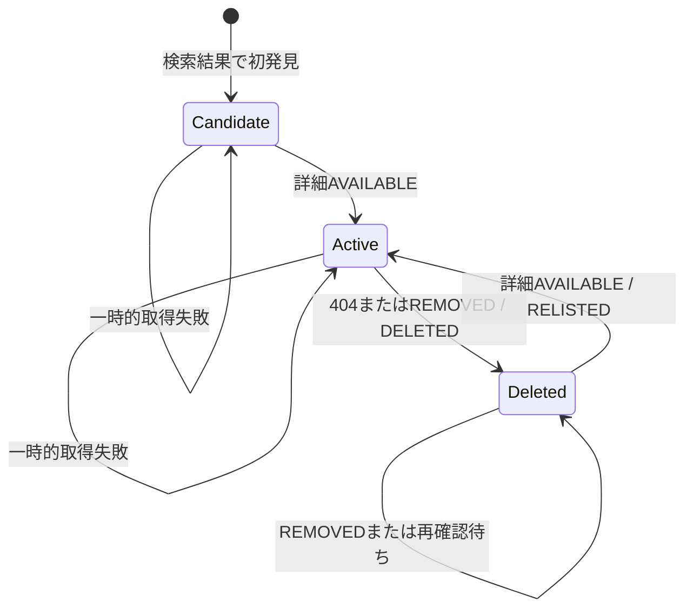

# 求人変更の判定

- 状態: Draft

## 用語

| 用語 | 定義 |
| --- | --- |
| 求人 | `source_key`と`external_job_id`で識別されるサイト内の掲載単位 |
| 監視内新着 | 求人が特定の監視検索に初めて現れ、詳細ページを正常取得できた状態 |
| 版 | 変更時に追加保存される詳細URL、生HTML、比較用ハッシュ |
| 掲載削除 | 詳細ページが404またはサイト固有の掲載終了表示になった状態 |
| 再掲載 | 掲載削除済み求人の詳細ページが再び有効と確認された状態 |

## 同一性

- 求人の同一性は`(source_key, external_job_id)`で判定する。
- URLは変更され得る属性であり、同一性には使わない。
- 異なるサイトの同じIDは別求人とする。
- 同じ求人が複数の検索URLに現れた場合、求人とHTML版は共有し、監視対象との関連と通知は分ける。
- 異なる求人サイト間の名寄せは行わない。

## 状態遷移

`Candidate`は未取得作業と`job.current_revision_id`がない状態で表し、独立した求人状態値を必須としない。

## 判定規則

判定は次の優先順とする。

| 優先 | 観測 | 事前状態 | 更新 | イベント |
| --- | --- | --- | --- | --- |
| 1 | 通信失敗、401、403、429、5xx、`UNEXPECTED` | 任意 | 求人状態を維持し、取得失敗を記録 | なし |
| 2 | 404または`REMOVED` | 有効 | `is_deleted=true`、`deleted_at`設定 | `DELETED` |
| 3 | 404または`REMOVED` | 削除済み | 最終確認時刻だけ更新 | なし |
| 4 | `AVAILABLE` | 未取得 | 最初の版を追加、有効化 | 各新規`watch_job`へ`NEW` |
| 5 | `AVAILABLE`かつハッシュ同一 | 有効 | URLと最終確認時刻だけ更新 | なし |
| 6 | `AVAILABLE`かつハッシュ相違 | 有効 | 新しい版を追加 | 関連する有効監視へ`UPDATED` |
| 7 | `AVAILABLE` | 削除済み | 必ず新しい版を追加し有効化 | 関連する有効監視へ`RELISTED` |

検索結果から求人が消えたことだけでは削除と判定しない。検索順位変動、ページ上限、条件変更による誤削除を避けるため、削除の正本は詳細ページの状態とする。

同一求人の詳細確認は、SQLiteの短い書き込みトランザクション開始後に直前ハッシュと削除状態を再読して確定する。複数ワーカーが同じ求人を処理しても、版とイベントの一意制約により片方だけを確定し、競合した処理は最新状態を再読して終了する。SQLiteでは行ロックや`SKIP LOCKED`を前提にしない。

## 例外

- 詳細URLが変わっても求人IDが同じなら同じ求人としてURLを更新する。
- 200でログインページ、bot対策ページ、同意画面へ遷移した場合は`UNEXPECTED`であり削除ではない。
- 求人IDが再利用され、内容が全面的に変わってもサイト内IDが同じ限り更新として扱う。再利用が確認されたサイトはアダプター固有規則をADRで追加する。
- 正規化規則を変更すると全求人のハッシュが変わり得る。移行時は旧規則と新規則を比較し、一括更新通知を抑止する。

## 冪等性

- 検索作業は`watch_id`と予定時刻で重複排除する。
- `watch_job`は`(watch_id, job_id)`でupsertする。
- 詳細確認では求人行をロックし、現在版のハッシュを再比較してから連番の求人版を追加する。同じ内容へ戻る更新も履歴として追加する。
- イベントは種別ごとの重複排除キーを持つ。
- 通知は`(event_id, notification_destination_id)`を一意にする。
- lease期限切れ作業は別ワーカーが再取得できる。
- `busy_timeout`を超えた`SQLITE_BUSY`は、同じ作業IDのまま上限付きで再試行する。

## テストケース

| ID | 入力・事前状態 | 期待結果 |
| --- | --- | --- |
| CD-001 | 未知IDの有効詳細ページ | 初版と`NEW`を1件作成 |
| CD-002 | CD-001と同じ作業を再実行 | 版、イベントを追加しない |
| CD-003 | 生HTMLのnonceだけが変化 | ハッシュ同一、イベントなし |
| CD-004 | 求人本文が変化 | 新版と`UPDATED`を1件作成 |
| CD-005 | 詳細取得が429 | 有効状態を維持、再試行 |
| CD-006 | 詳細が404 | 論理削除と`DELETED`を1件作成 |
| CD-007 | 削除済み求人を再び404確認 | イベントを追加しない |
| CD-008 | 削除済み求人が有効ページへ復帰 | 新版と`RELISTED`を1件作成 |
| CD-009 | 検索結果からのみ消失 | 論理削除しない |
| CD-010 | 同一求人を2つの監視が発見 | 求人・版は1件、監視関連と新着イベントは各1件 |
