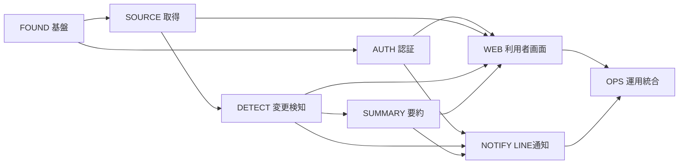

# MVP実装優先順位

- 状態: Accepted

## 目的

変更検知の正しさを早期に縦断検証し、その上へ利用者機能と外部通知を積み上げる順序を定める。

## 順序の原則

- DB制約、冪等性、所有権境界を後付けにしない。
- 外部サービスは境界を分離し、失敗時も中核の状態遷移を検証できるようにする。
- 1段階ごとに、実行可能なコード、テスト、必要な文書をまとめて完成させる。
- 未完了の依存を仮実装で隠さず、バックログ上の依存として管理する。

## 依存関係

## 優先段階

| 順位 | カード | 完成させる縦断能力 |
| --- | --- | --- |
| 1 | `MVP-FOUND-001` | アプリ、DB、作業キュー、テストを実行できる基盤 |
| 2 | `MVP-SOURCE-001` | 検索URLから求人固有HTMLとタイトルを安全に取得・保存する経路 |
| 3 | `MVP-DETECT-001` | 基準化、発見、更新、掲載終了、再掲載を冪等に確定する経路 |
| 4 | `MVP-SUMMARY-001` | 現在・変更要約を生成し、制限時に機械抽出情報へフォールバックする経路 |
| 5 | `MVP-AUTH-001` | Google認証、セッション、所有権、アカウント削除の境界 |
| 6 | `MVP-WEB-001` | 監視設定と現在求人を利用者が管理・閲覧する画面 |
| 7 | `MVP-NOTIFY-001` | LINE連携と通常・遅延ダイジェストを安全に配信する経路 |
| 8 | `MVP-OPS-001` | 全経路の観測、安全停止、復旧、保守を含む運用可能性 |

`MVP-SUMMARY-001`と`MVP-AUTH-001`は、それぞれの依存完了後は並行して進められる。順位は統合の基準順を表し、並行作業を禁止しない。

## 着手禁止条件

- バックログカードが`Ready`でない。
- 依存カードが`Accepted`でない。
- 対象サイトの取得許可または期待HTMLを確認できない。
- 外部認証・通知の資格情報をテストから分離する方法が決まっていない。
- 受入条件を再現するfixtureまたはテスト境界を用意できない。

## 完了条件

- 8枚の親カードが`Accepted`である。
- 各カードの受入条件と要件・設計上の根拠を追跡できる。
- MVPの縦断テストと運用確認が完了している。

## 根拠文書

- [MVP機能範囲](./scope.md)
- [求人変更監視要件](../../../product/requirements.md)
- [システム設計](../../../architecture/system-design.md)
- [求人監視データモデル](../../../architecture/data-model.md)
- [技術スタック](../../../architecture/technology-stack.md)

[MVP計画へ戻る](./README.md)
