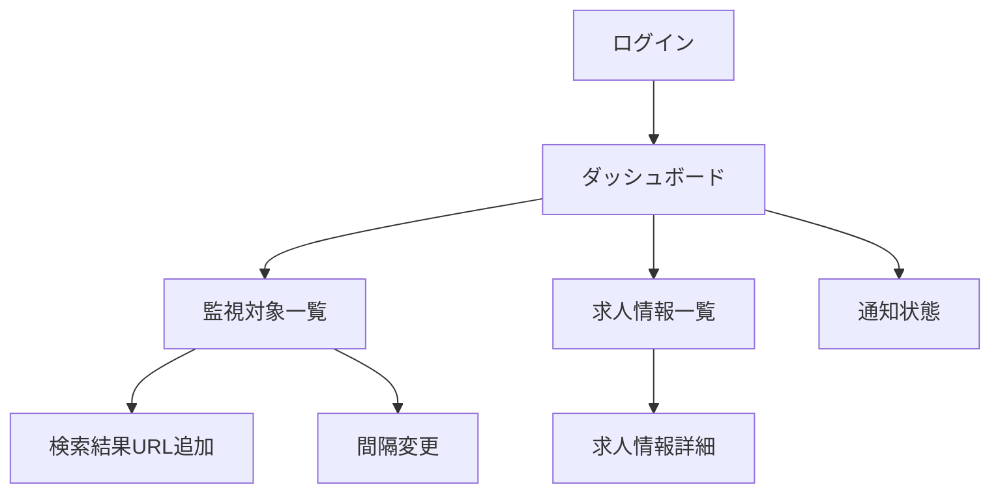

# 求人監視Web UI

- 状態: Draft
- 対象: Jinja2でサーバーサイドレンダリングする利用者向け画面

## 目的

利用者がGoogleで会員登録・ログインし、監視する求人検索結果URLと確認・通知間隔を設定し、検知した求人情報を閲覧できるようにする。LINE通知は任意でONにでき、通知の配信自体はバックグラウンドで行う。

## 対象範囲

- Google会員登録・ログイン、ログアウト
- 監視対象の一覧と検索結果URLの追加
- 監視対象ごとの確認・通知間隔の選択
- 新着、更新、削除、再掲載された求人の一覧と詳細表示
- LINE通知のON・OFF、LINE本人確認、友だち追加状態の表示
- バックグラウンド処理の最終実行結果とエラー状態の表示

## 対象外

- 利用者による求人サイトアダプター実装の追加
- 取得した求人HTMLの直接表示
- 求人への応募
- 管理者向けのサイト追加、レート制限、再実行操作

## 画面構成

| 画面 | 主な表示 | 利用者操作 |
| --- | --- | --- |
| ログイン | Googleで続行ボタン、利用規約・プライバシーへの導線 | Google会員登録・ログイン開始 |
| ダッシュボード | 新着・更新件数、監視状態、最終確認時刻、通知状態 | 各機能へ移動 |
| 監視対象一覧 | サイト名、検索結果URL、間隔、状態、最終成功・次回予定 | 追加、間隔変更、停止 |
| 検索結果URL追加 | URL、確認・通知間隔 | 登録 |
| 求人情報一覧 | 変更種別、要約の見出し、サイト、検知日時、掲載状態 | 絞り込み、詳細表示 |
| 求人情報詳細 | 求人ID、要約、詳細URL、変更履歴、検知・確認日時 | 外部求人ページを開く |
| 通知状態 | LINE通知のOFF・連携中・友だち追加待ち・有効・ブロック状態、最終配信結果 | ON、OFF、LINE連携、友だち追加、再連携 |

「求人サイト追加」という利用者向け操作は、対応済み求人サイトの検索結果URLを監視対象へ追加することを意味する。未対応サイトのURLを受け付けてアダプターを自動生成する機能ではない。

## ユースケース

### 初回会員登録・ログイン

1. 利用者が「Googleで続行」を選択する。
2. Googleの認可画面からcallback後、初回なら利用規約等への同意を確認して利用者とGoogle認証IDを作成する。
3. 元の遷移先が安全に復元できる場合はそこへ、なければダッシュボードへ遷移する。

LINE通知はこのログイン処理では自動的に有効化しない。

### LINE通知をON

1. Googleログイン済み利用者が通知状態画面でLINE通知をONにする。
2. LINEへのログイン画面で、通知先となるLINEアカウントの本人確認を行う。
3. LINE公式アカウントの友だち追加を促す。
4. LINE連携と友だち追加の両方を確認できた場合に「有効」と表示する。
5. 友だち追加が未完了またはブロック中なら「要対応」とし、追加またはブロック解除の導線を表示する。

LINE連携に失敗またはキャンセルしてもGoogleログイン状態と監視設定を変更しない。

### 検索結果URLの追加

1. 利用者が検索結果URLと`12時間`または`24時間`を入力する。
2. サーバーがURLを対応アダプターで検証する。
3. 成功時はPost/Redirect/Getで監視対象一覧へ戻り、初回取得を「待機中」と表示する。
4. 未対応URL、重複URL、不正URLでは、値を保持したまま項目近くにエラーを表示する。

### 求人情報の閲覧

求人一覧はログイン利用者の監視対象に関連する求人だけを表示する。既定は検知日時の降順とし、変更種別と掲載状態で絞り込める。詳細画面は現在の要約と変更履歴を表示し、求人サイトの詳細ページは外部リンクとして開く。

## 機能要件

| ID | 要件 |
| --- | --- |
| UI-001 | 未ログイン利用者にはGoogle会員登録・ログインを提示し、保護画面へ直接アクセスした場合はログイン後に安全な遷移先へ戻す。 |
| UI-002 | 対応済み求人サイトの検索結果URLを追加できる。 |
| UI-003 | 監視対象ごとに確認・通知間隔を12時間または24時間から選択できる。 |
| UI-004 | 登録、間隔変更、停止はPOSTで行い、CSRF対策とPost/Redirect/Getを適用する。 |
| UI-005 | 自分の監視対象と求人情報だけを閲覧・変更できる。 |
| UI-006 | 求人情報一覧で新着、更新、削除、再掲載と現在の掲載状態を識別できる。 |
| UI-007 | 求人詳細で要約、変更履歴、掲載状態、詳細URL、最終確認時刻を閲覧できる。 |
| UI-008 | 取得HTMLを画面へ直接描画せず、Jinja2の自動エスケープを維持する。 |
| UI-009 | 通知処理は利用者操作なしで実行され、画面には通知先状態と最終配信結果を表示する。 |
| UI-010 | キーボード操作、明示的なlabel、エラー概要、十分な色コントラストを提供する。 |
| UI-011 | LINE通知をOFFからONへ変更した場合だけLINEログインと友だち追加を案内する。 |
| UI-012 | LINE通知をOFFにしてもGoogleログイン状態、監視設定、求人履歴を維持する。 |

## 非機能要件

- モバイル幅を主要表示対象とし、LINEアプリ内ブラウザーでも操作可能にする。
- JavaScriptがなくても登録、間隔変更、閲覧、ログアウトを完了できる。
- 日時は保存時にUTCとし、画面では利用者のタイムゾーンで表示する。初期値はAsia/Tokyoとする。
- URL全文や要約が長くても画面幅を破壊しない。
- バックグラウンド処理の待機中、成功、失敗を「完了」と誤認しない表現で表示する。

## 受入条件

| ID | 条件 |
| --- | --- |
| UI-AC-001 | Googleログイン後、利用者ごとのダッシュボードを表示できる。 |
| UI-AC-002 | 対応済みサイトの検索結果URLと12時間を登録すると一覧に表示され、初回取得作業が作成される。 |
| UI-AC-003 | 未対応host、詳細ページURL、同一利用者の重複URLを登録できない。 |
| UI-AC-004 | 12時間から24時間へ変更すると、次回予定時刻が新しい間隔に従って再計算される。 |
| UI-AC-005 | 他利用者の監視対象IDまたは求人IDをURLへ指定しても閲覧・変更できない。 |
| UI-AC-006 | 求人詳細画面に保存HTML内のscriptやタグが実行・描画されない。 |
| UI-AC-007 | LINE未連携の利用者もGoogleでログインし、監視設定と求人閲覧を利用できる。 |
| UI-AC-008 | LINE通知をONにするとLINE本人確認と友だち追加へ進み、完了後に有効状態を表示する。 |
| UI-AC-009 | LINE通知をOFFにしてもGoogleログインセッションが無効化されない。 |

## 未決事項

- 監視対象を停止するだけでなく完全削除できるようにするか
- 求人情報の未読・既読管理を追加するか
- 一覧のページサイズと保持期間を超えた履歴の表示

## 関連文書

- [Webバックエンド](../architecture/web-backend.md)
- [求人変更通知](../notification/job-change-notifications.md)
- [技術スタック](../architecture/technology-stack.md)
